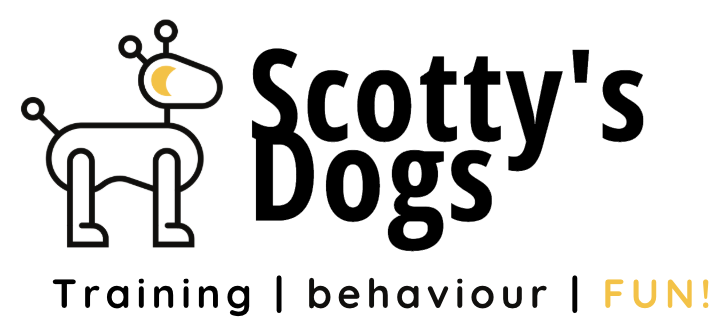

# 
Scotty’s Dog Training & Behaviour

This website is my first milestone project for the Code Institutes Full Stack Software Development Course. The goal of the project was to create a fictitious website for a professional Dog Trainer who specialises in dog training & behaviour modification.
The target audience for the website are dog owners who need support in dog training and behaviour modification. The services are aimed at both new and existing customers and dogs of all ages and breeds. 
The website is for educational purposes only

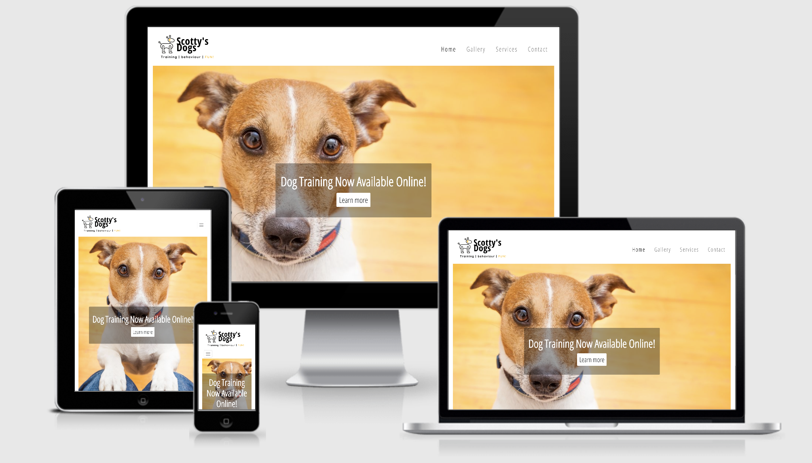

The image above is a visual of the site displayed on different devices using [I Am Responsive](http://ami.responsivedesign.is/#)

### You can view the live site here: [www.scottysdogs.com](https://scotty-james.github.io/Milestone-Project-1/)
 
 ## Contents

 - [**User Experience (UX)**](#ux)
    - [User Stories](#user-stories)
    - [Strategy](#strategy)
        - [*External user’s goal*](#external-user’s-goal)
        - [*Site owner's goal*](#external-user’s-goal)
    - [Scope](#scope)
        - [*Scope In*](#scope-in)
        - [*Scope Out*](#scope-out)
    - [Structure](#structure)
        - [*Home Page*](#home-page)
        - [*Services Page*](#services-page)
        - [*Image Gallery*](#image-gallery)
        - [*Contact page*](#contact-page)
        - [*Footer*](#footer)
    - [Skeleton](#skeleton)
        - [*Wireframes*](#mobile-wireframes)
    - [Surface](#surface)
        - [*Design*](#design)
        - [*Colour*](#colour)
        - [*Typography*](#typography)
- [**Features**](#features)
    - [*Existing Features*](#existing-features)
    - [*Features Left to Implement*](#features-left-to-implement)
- [**Technologies Used**](#technologies-used)
    - [*Languages*](#languages)
    - [*Frameworks & Libraries*](#frameworks-and-libraries)
- [**Testing**](#testing)
    - [*W3C Validation*](#w3c-validation)
    - [*Responsiveness Validation*](#responsiveness-validation)
    - [*Dev Tools*](#dev-tools)
    - [*Link & Hover Validation*](#link-and-hover-validation)
    - [*Form Validation*](#form-validation)
    - [*Image Validation*](#image-validation)
    - [*User Story Testing Validation*](#user-story-testing-validation)
    - [*Browser Validation*](#browser-validation)
    - [*Site Performance Validation*](#site-performance-validation)
- [**Deployment**](#deployment)
    - [*Deployment Steps*](#deployment-steps)
    - [*How To run this Project Locally*](#how-to-run-this-project-locally)
- [**Credits**](#credits)
    - [*Content*](#content)
    - [*Media*](#media)
    - [*Code*](#code)
- [**Resources**](#resources)
- [**Acknowledgements**](#acknowledgements)

---

## 
 UX
 
### User Stories

- As a dog owner, I want to quickly see the website training methodology so that I know they align with my beliefs. 
- As a Dog Owner, I want to work with a qualified professional that uses positive reinforcement training methods only so that my family and I can learn the tools for continuous positive training throughout our dog’s life. 
- As a dog owner, I want to be able to quickly see the types of services on offer, so that I can determine if the trainer is a right fit for me. 
- As a new puppy owner, I want to be able to house train him/her as quickly as possible so that my dog learns good behaviours from an early age. 
- As a dog owner, I want to have the option of online training, so that I can still work on my dogs behaviour during the current pandemic. 
- As a dog owner, I want to see that the site owner is accessible so that I can contact easily when needed. 

### Strategy

#### External user’s goal
- Find professional help in solving specific issues relating to their dog’s behaviour. The idea of owning a dog has become different from reality and they would want to improve their dogs behaviour which in turn will reduce stress levels. 
- The site must convey that the training methods used are positive reinforcement and the use of force in training is not acceptable.
- A desire to understand dog training methods that can be practised easily in the home, getting the entire family involved. 
- As the dog is an important member of the family, trust is key and must be conveyed throughout the site.

#### Site owner's goal
- Create a website that provides a specific need for Dog Owners (user) what will generate income via the sale of various dog training solutions.
- Promote the importance of professional training and how this can  not only impact the dog’s life in a positive way, but also that of the entire family. 
- Demonstrate that training is not as difficult as some may and individual training plans, combined with consistency and fun, real positive results are achievable. 
- Demonstrate that the use of force in dog training no longer is acceptable nor desirable and that positive reinforcement techniques are key to how dogs learn. 

### Scope

#### Scope In 
- A web page that provides the end user (Dog Owners) with in person or online training programs that will help solve a specific or multiple dog behaviour problems - programs will target a specific set and common dog behaviour issues. 
- Demonstration of the site owners training methods.
- Provide the user with a visual experience of the site owners training history.
- Ability to contact the site owner for further information on any of the services offered within the site. 

#### Scope Out
- Group Class information, scheduling or ability to book directly on site will not be in scope for the first release.
- Advanced training programs will not be in scope for first release (example, advanced aggressive behaviour, scent work, any potential behavioural issues that could be resulting from a medical condition)

### Structure
The structure of information on the site will follow a simple approach with 4 pages: 
#### Home Page
- Key call to action for a new product on the landing page above the fold. 
Featured products with CTA’s that take the customer to the main Services page.
#### Services Page
- Provides details of the various training programs available to the end user. 
Each product will have a CTA that navigates the customer to the contact us page. 
#### Image Gallery
- A simple gallery of images demonstrating past dog training sessions with customers and their dogs. 

#### Contact page
Contact methods include a form, a phone number, an email address, and social media. 

#### Footer 
- Fixed and will contain contact information, social media presence, and links to the services page. 

### Skeleton
- The site will be designed to allow the user to flow effortlessly from the home page to the contact us page with just the right amount of information to spark curiosity in the customer. The conversion goal for phase one of the site release is for the customer to contact the site owner.
- Each page will have a navigation bar to allow the user to self navigate. 
- Home page will have 3 or 4 featured products max, with each product having a clickable CTA that will navigate to the main services page where more detailed information is provided. 
- The main services page will provide more detail on each service offered, with each having a clickable CTA that navigates the customer to the Contact us page. 
- The Contact us page will provide a simple contact form with a text box for the user to provide a description of their needs. Additional contact methods will be displayed underneath the form (phone number, email address, social)
- The site navigation is designed to take the customer to the contact form page in 3 clicks max. 

#### Mobile Wireframes
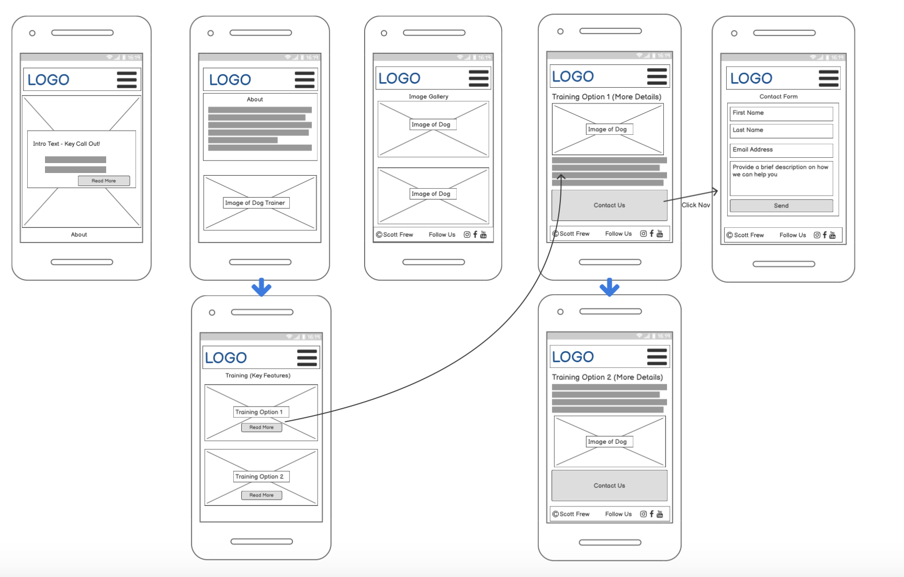

[Wireframes for both mobile and desktop can be found here](https://github.com/scotty-james/Milestone-Project-1/blob/master/assets/docs/website-wireframes.pdf)

### Surface

#### Design
My main goal for the site design is simplistic and clean throughout. I wanted to provide a crisp design that did not have strong contrasting colors so that it was simple on the users eye as they navigated through each section.
A stronger focus on dog related images is designed to create a strong emotional response from the sites target audience. 

#### Colour
The main color scheme used throughout the site are 
- #212529
- #fca311

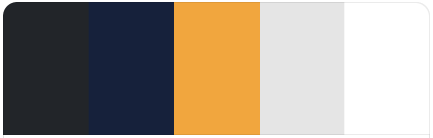

#### Typography
I have used 2 fonts throughout the site which were paired in [google fonts](https://fonts.google.com/specimen/Open+Sans+Condensed#pairings) - Open Sans Condensed and Open Sans. Open Sans condensed is used for Title Headings throughout the iste and is set to uppercase whereas Open Sans is used for sub heading text. I had originally imported ‘Quicksand’ for the sub heading text however, once I added content to the site I felt the text didn't contrast well within the site, therefore changed to Open Sans for a better UX. 

---
## 
Features
 
### Existing Features
- Navigation bar with links to each page to allow the user to move back and forth freely, and freely browse pages that interest them most.
- Hero image with a strong CTA for the site owners Online Training program which is a need for both user and site owner during covid19.
- Clear visual demonstration on the homepage of the types of services on offer to the user so that the user is in no doubt what the website intention is. 
- An about us section on the homepage to draw the customers attention to the training method / philosophy used. 
- An image gallery to provide the user with a visual demonstration of the site owners dog training history to help build consumer trust. 
- Services displayed on a main services page provide the user with the information they need all in one section. 
- A simplistic contact us form, with phone, email and social contact options all in one page to enable flexibility and simplicity for the user to contact the site owner. 
- A fixed footer with contact information, social links, and additional navigation links to services offered to add more ease in for the user experience.  
- The website is responsive on all sites and built with a mobile first approach.

### Features Left to Implement
- A booking form to allow customers to book training directly on site. 
- A more detailed services page to provide the user with more information on how each training program can support their specific problem. 
- A page dedicated to class training programs that run for x number of weeks with a class schedule / timetable for future classes that can be booked in advance. 
- Specific pages that provide valuable non purchasable content for the user to interact with and take away - for example, how dogs learn, fun facts, diet tips, blogs etc. 

---
## 
Technologies Used

### Languages
- HTML5
- CSS3

### Frameworks and Libraries
- [Bootstrap](https://getbootstrap.com/docs/4.5/getting-started/introduction/) - was used as my main framework for structuring the website. 
- [Google Fonts](https://fonts.google.com/) - used to select the text font to be used throughout the site. 
- [Font Awesome](https://fontawesome.com/icons?d=gallery) - for the icon graphics used on the contact-us page.
- [Gitpod](https://www.gitpod.io/) - used for version control via the Gitpod terminal by providing regular commits to Git, and pushing to GitHub.
- [Git](https://git-scm.com/) - used as my IDE.
- [GitHub](https://github.com/) - for my Git repository.
- [Balsamic](https://balsamiq.com/) - used to create the website wireframes.
- [Coolors](https://coolors.co/) - used to pick the colour theme for the website.
- [Tinyjpg](https://tinyjpg.com/) - used for image resizing.
- [Favicon Generator](https://favicon.io/favicon-converter/) - used for generating the site favicon.
---
## 
Testing

### W3C Validation

I ran all files through the official W3C validator with the following results: 
- Index.html: No errors or warnings to show.
- Gallery.html: No errors or warnings to show.
- Services.html: No errors or warnings to show.
- Contact.html: No errors or warnings to show.

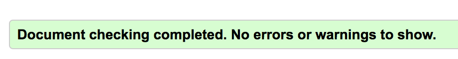

- style.css: Congratulations! No Error Found.

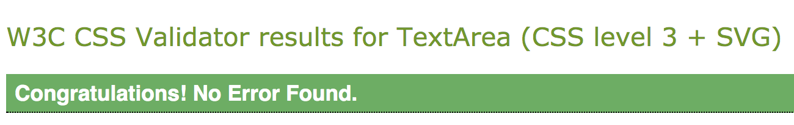

### Responsiveness Validation

#### Dev Tools
I used Chrome Dev Tools to check the site on available devices to ensure the site was fully responsive. I checked each page individually on each device type. 

Manual Device Check:

I checked the site manually on the following devices - all pages check seperately. 
- Samsung S10
- Iphone X
- Macbook Pro 
- Ipad Pro
- Monitor Screen 

#### Link And Hover Validation
I went through each page individually to manually check that all links & hover styling worked as intended. This test was performed on both mobile and desktop devices. 

- index.html: 
    - First call to action link on the hero image:
    - All 3 feature CTA’s under dog training programs:
    - Footer links: Message us modal, all three social links, all four services links at the right hand side of the footer, and the badge alert in front of the ‘online training’ link.

- Gallery.html:
    - Footer links: Message us modal, all three social links, all four services links at the right hand side of the footer, and the badge alert in front of the ‘online training’ link.

- Services.html:
    - All 4 ‘contact us’ CTA links in the main body of the page.
    - Footer links: Message us modal, all three social links, all four services links at the right hand side of the footer, and the badge alert in front of the ‘online training’ link.

- Contact.html:
    - Form input link ‘send’ - note that this form is not set up to submit requests and is not connected to any database, so for this version of the site, this is working as intended. 
    - Each contact option underneath the contact form (phone, email & social) to ensure the phone number dial out and email application opens when clicked, and the social icon navigates to instagram. 
    - Footer links: All three social links, all four services links at the right hand side of the footer, and the badge alert in front of the ‘online training’ link.

- Navbar
    - Tested each navigation link on all pages both forward and backward to ensure each page was returning as intended. 

- Logo: 
    - Test the logo link on each page to ensure navigation back to index.html. 

#### Form Validation

- Contact form on contact.html: 
    - Checked on both mobile, ipad and desktop devices. 
    - Submit form without email address added to ensure input field ‘required’ attribute was working correctly and alert displayed prompted customer to input email address. 
    - Submit form without name added to ensure input field ‘required’ attribute was working correctly and alert displayed prompted customer to input email address.

- Modal Form Validation: 
    - I tested the modal form on each page it is displayed on both mobile, ipad and desktop devices. 
    - Submit form without email address added to ensure input field ‘required’ attribute was working correctly and alert displayed prompted customer to input email address. 
    - Submit form without name added to ensure input field ‘required’ attribute was working correctly and alert displayed prompted customer to input email address.
    - Check the close button to ensure the form closes when prompted by the user. 

#### Image Validation
-   I went through each page to ensure all images displayed correctly. 
-   I went through HTML code on each file to ensure all Alt Text had been applied correctly to each image url.

#### User Story Testing Validation

*As a dog owner, I want to quickly see the website training methodology so that I know they align with my beliefs.*
- I’ve included this just underneath the first CTA in the about us section which highlights the training methodology used which is positive reinforcement only.
- This messaging is positioned early in the journey to ensure the user sees this before they move to the featured services section of the page. 

*As a dog owner, I want to work with a qualified professional that uses positive reinforcement training methods only so that my family and I can learn the tools for continuous positive training throughout our dog’s life.*
- In the content contained within the about us section I’ve described how the training methodology used is both fun and can involve the entire family.
- Getting the family involved in training is also encouraged to provide the user with confidence that their needs will be met. 

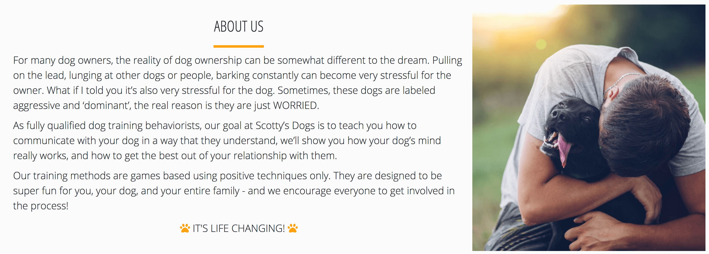

*As a dog owner, I want to be able to quickly see the types of services on offer, so that I can determine if the trainer is a right fit for me.*
- The next section the user will see as they move through the journey is the key services offered, which is broken into 3 key areas - in person 1 to 1 training, online training, and puppy training. 
- It is the site owners intent to capture the broad range of issues the user is likely to be experiencing. The intent is to draw the customer further into the funnel, which details more granular level programs. 

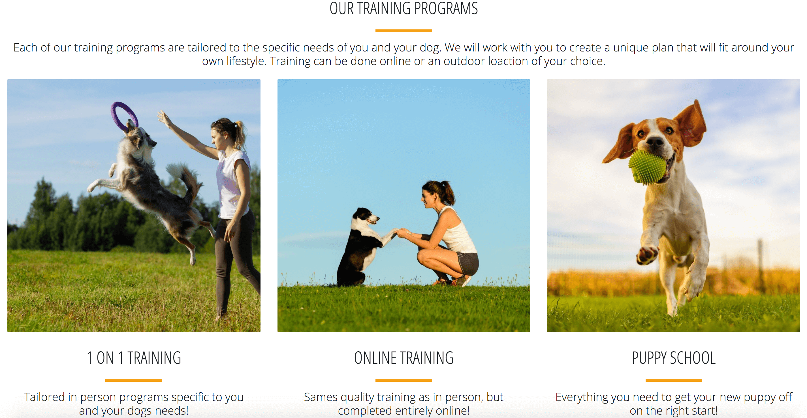

*As a new puppy owner, I want to be able to house train him/her as quickly as possible so that my dog learns good behaviours from an early age.*
- A very common need of all new puppy owners, therefore I have included this on the main page as a key feature. 
- The user can click on this feature for further information, which then links the customer to more details of the program - which covers the most common needs of new puppy owners. 

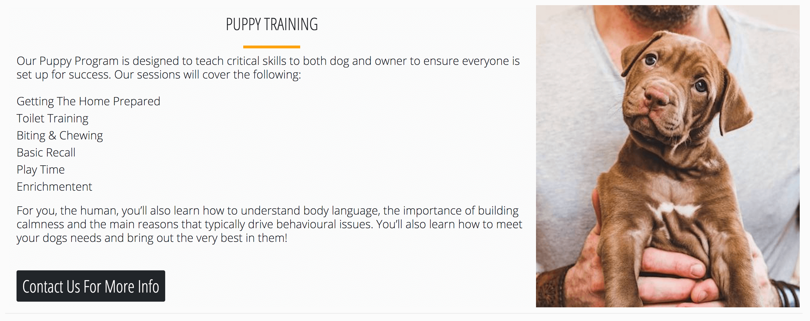

**As a dog owner, I want to have the option of online training, so that I can still work on my dogs behaviour during the current pandemic.*
- Online training is a key diversification feature for any dog training business to survive during the current climate. I’ve included this above the fold on the main home page. Again in the key features section below the fold, and again in the services page as the first training program displayed. 
- In the footer, I've also included this in the service links with an alert badge displayed to the right of the link to dra the customers attention - this is included in the footer of all pages. 

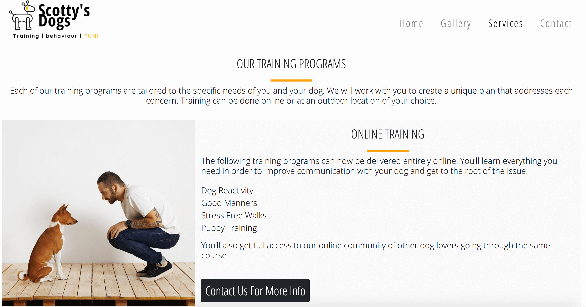

As a dog owner, I want to see that the site owner is accessible so that I can contact easily when needed.*
- I’ve included a phone number and massage form in the footer of the Home page, the Gallery page and the Services Page. 
- I’ve also included a dedicated contact us page which displayed multiple contact options to ensure choice depending on the ensures preferences. 
- I removed the message button from the footer of the contact page as I deemed it unnecessary due to the level of contact options available throughout the page. 

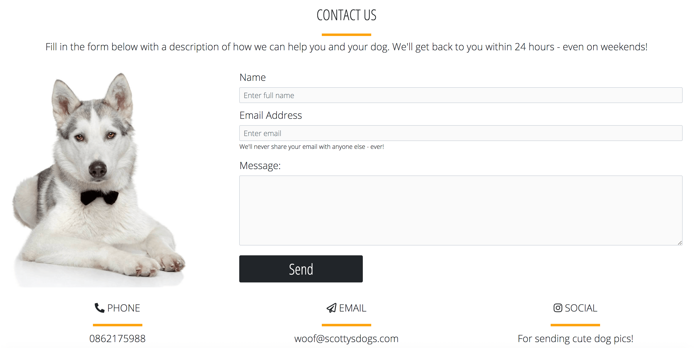

### Browser Validation

In addition to testing on google chrome, I tested the all links and image display on the Safari and Firefox browsers. 

### Site Performance Validation

To test the sites performance I used Lighthouse in Chrome Dev Tools: 

#### Results: 
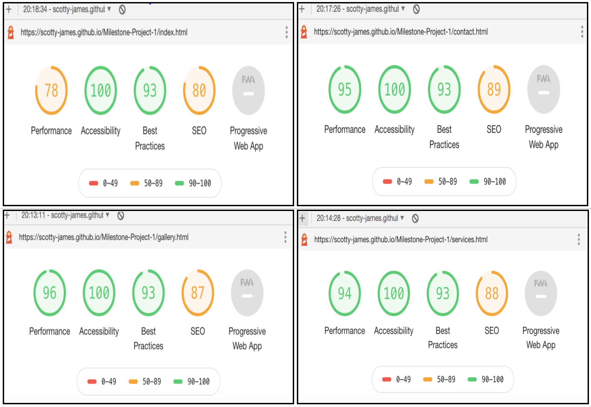

The score is high on gallery.html, service.html and contact.html. Index.html scored lower for the following mainly reasons. 
Render blocking resources: Bootstrap & Font Awesome Stylesheet links.
Image sizes not being optimised. However, I have compressed the images as much as I can without affecting quality. 

The site scored low on SEO mainly due to each file not having an appropriate meta description for the site's purpose. To solve this I added the following meta description: 

`<meta name="description" content="Professional dog training and behaviour modification services">`

I then restested performance on Lighthouse which demonstrated the following performnce improvement:

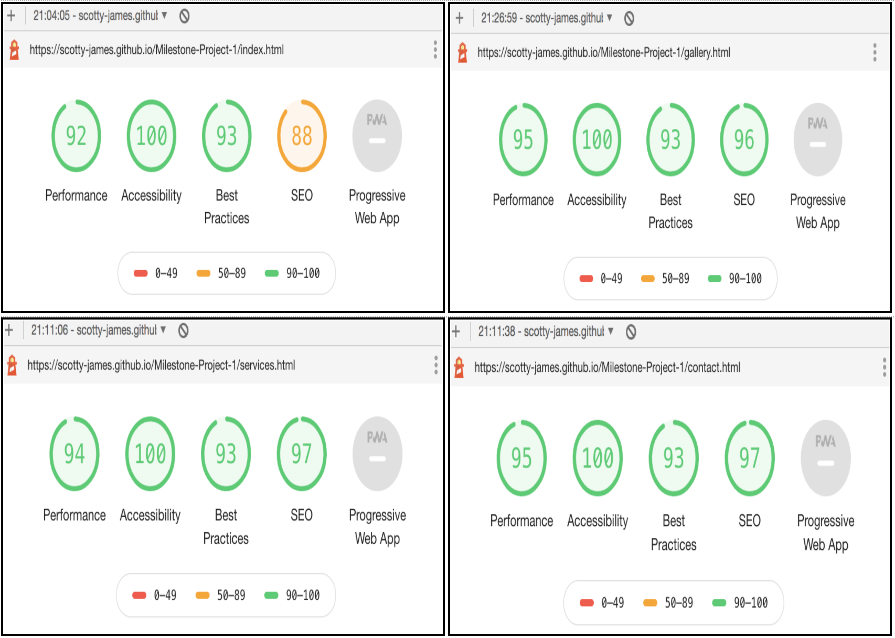

### Fixed Bugs

Bugs discovered in the final stages of development and during/after deployment

| Bug         | Fix         |
| ----------- | ----------- |
|  All buttons were displaying a flash of blue behind the styled colour when clicked|  Upon investigation, I noticed the btn-primary class was still present in the html code, this was removed to resolve the issue.|
|  The links contained within the main body of the home page were not navigating to the the correct location on services.html|I had previously updated the updated the ID targets in the footer to be more descriptive however these updates were not applied in these links, updated to resolve.  |
|  On the gallery page, the images on the bottom row were overlapping onto the footer. |Added margin to the body to push create the required space that aligned with the grid-gap values in CSS. |
|  On the services page, the buttons were pressed hard against the bottom of the div| Added additional margin to increase the space and overall UI of the page. |
|  On the gallery page, there was a lot of white space between the title and the block divider, which did not flow correctly when flicking from page to page |I removed unnecessary padding and margin to bring the style in line with the services and contact pages for a better UI. |
|  The modal close button was displaying extremely small and hardly visible |I could not find the reason why this was the case in the first place, however, I fixed by targeting the span and increasing the font size in CSS|
|  The image on the contact page did not size well on mobile, cutting most of the image out |I resized the image as much as possible but quality was being affected. I fixed by replacing the image, which greatly improve UI|
|  The hero image on the home page was displaying slightly to the left on mobile | Image was resized to create a more centered look and feel. I played around with various styling in an attempt to better center using CSS, but resizing provided a better look|
---

## 
Deployment 
### Deployment Steps
The following steps were taken to deploy this website to Github pages from it’s main Github repository. 
Log into my Github account.
1. Navigate to the site’s repository.
1. Under the site repositories name, click ‘Settings’
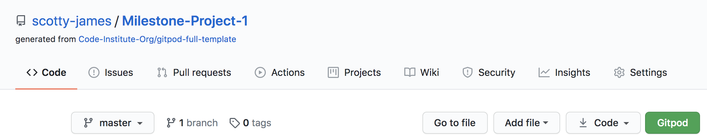
1. Scroll down the page to ‘GitHub Pages section’
1. Under Source, click on the dropdown tab that is defaulted to ‘None’
1. Select ‘Branch: Master, then hit Save. 
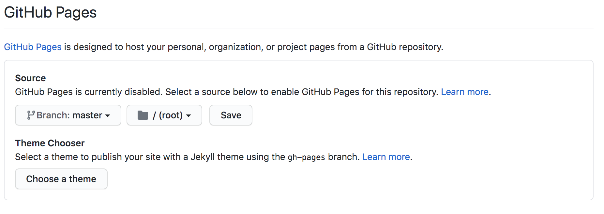
1. At this point, the page is automatically refreshed and the website is deployed. 
1. Scroll back down to the GitHub pages section to obtain the url to the newly published site. 
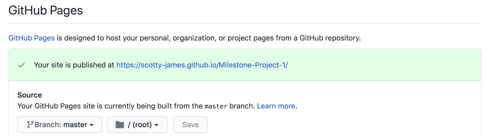

### How To run this Project Locally
1. [click here to access the site's repository](https://github.com/scotty-james/Milestone-Project-1)
1. Underneath the repository name, click ‘Code’ which will open a drop down menu. 
1. Click the HTTPs section (a red line should be displayed underneath).
1. To clone the repository using HTTPS, under "Clone with HTTPS", click the clipboard icon. 
1. Open your IDE terminal
1. Type ‘git clone’ and paste in the url you just copied - it should look like this `$ git clone https://github.com/scotty-james/Milestone-Project-1.git`
1. Press enter which will then create your local clone. 

---

## 
Credits

### Content
- All content on the site was written by the website developer. 
### Media
- The photo images used in this site were obtained from Canva.com unless specifically stated below. 

### Code
[Bootstrap](https://getbootstrap.com/docs/4.5/getting-started/introduction/) documentation was used as the main structure for the site, this included the following:
- Navbar
- Bootstrap Cards
- Bootstrap Carousel (included in a earlier version of the site but removed mid way in favour of bootstrap cards)

Footer copyright code snippet was taken from [mdbootstrap](https://mdbootstrap.com/docs/jquery/navigation/footer/)

The following resources were used for the CSS grid layout for the image gallery with modifications made.
- [CSS Tricks](https://css-tricks.com/snippets/css/complete-guide-grid/)
- [CSS Tricks](https://css-tricks.com/introduction-fr-css-unit/)
- [EVAN MINTO](https://evanminto.com/blog/intrinsically-responsive-css-grid-minmax-min/)

For the Stretched links used throughout the site - [w3schools](https://www.w3schools.com/bootstrap4/bootstrap_cards.asp) 

To get the content on the services page to center only on mobile I used the code snippet from [Stack Overflow](https://stackoverflow.com/questions/29562527/twitter-bootstrap-text-center-when-in-xs-mode)

[Code Institute:](https://codeinstitute.net/) 
Inspiration throughout the site in terms of code structure was taken from both Resume and Whiskey drop mini projects. 
Footer Modal - Whiskey Drop Project (modal was then re designed and content / structure modified)

Contact Us form: Code from footer model reused and adapted / modified. 

---
## 
Resources
Resources used for general learning / problem solving
- Code Institute Slack Community
- Code Institute Course Content completed to date
- Youtube
- W3schools 
- Stackoverflow
- CSS tricks 
- Mike Traversy Media
- Anna Greeves’ Bootstrap Grid Tutorial
- MDN Mozilla

---
## 
 Acknowledgements
I would like to thank and acknowledge the following: 
- My mentor Spencer Barriball for the kind words of encouragement right from my very first planning call, and for providing inspiration and guidance throughout the project. 
- The Code Institute Slack Community for daily inspiration and providing a real sense of community and togetherness. The information shared in the community has been extremely valuable and my number one source of information and troubleshooting. I've learned so much in such a short space of time from this group of people and for that I am grateful!
- The module Lead, Jimmy Lynx, for providing constant support in the slack channel and a really valuable MS1 planning call, of which I got a great deal of learning from. 
